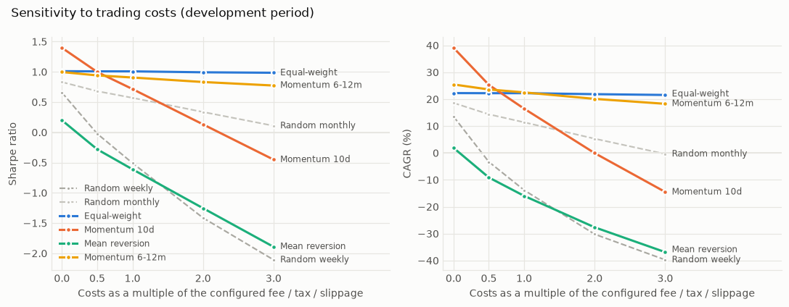
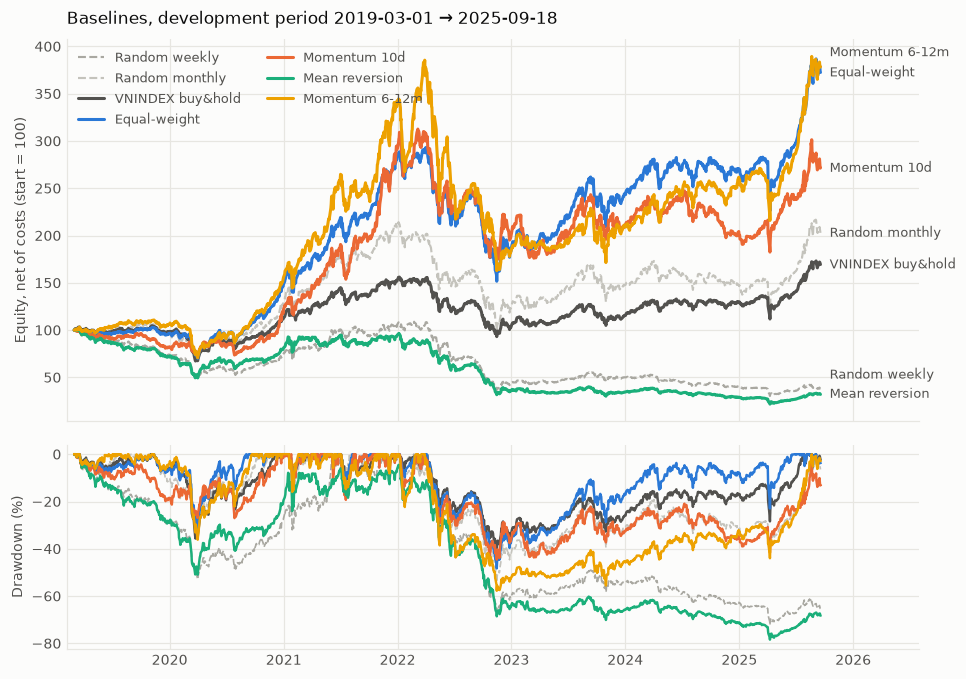

# Baselines — development period 2019-03-01 → 2025-09-18

Universe **LARGE50** (50 instruments) · capital 1,000,000,000 VND · top-K 10 · weight cap 15% · rebalance when a position is off target by 20% · config hash `8af57356cf7c`

**Held-out final period 2025-09-19 → 2026-09-18: not touched by any figure below.** It can be revealed once (`backtest oos`).

Costs: fee 0.15% per side, tax 0.10% on sells, slippage 0.10% against you on market orders, lot 100, T+2, price band inferred per date (inferred from trailing returns). *Costs, tax, tick table and settlement are the brief's defaults, not re-verified against current rules.*

## How to read these numbers

* **They are yardsticks, not results.** A model earns attention only by beating the relevant baseline *after costs* and beating the random noise floor below.
* **Absolute levels are inflated.** LARGE50 was chosen by *today's* traded value and applied backwards (look-ahead / survivorship), and prices are the vendor's back-adjusted series (dividends effectively reinvested), while the VNINDEX / VN30 benchmarks are price indices. Compare strategies with each other and with the noise floor, not with the index.
* Lots, tick sizes and price bands are applied to *adjusted* prices, so they are exact in the logic but approximate in level (see limits).

## After costs (development period)

| strategy | CAGR | Sharpe | Sortino | MDD | Calmar | turnover/yr | win rate | profit factor | expectancy/trade | trades | exposure |
| --- | --- | --- | --- | --- | --- | --- | --- | --- | --- | --- | --- |
| Equal-weight universe | 22.2% | 1.01 | 1.35 | -48.3% | 0.46 | 0.2 | n<30 | n<30 | n<30 | 4 | 98% |
| Random top-K, weekly | -13.8% | -0.51 | -0.66 | -72.1% | -0.19 | 40.8 | 46% | 0.85 | -0.27% | 2724 | 97% |
| Random top-K, monthly | 11.4% | 0.57 | 0.77 | -54.0% | 0.21 | 9.4 | 52% | 1.33 | 1.66% | 612 | 99% |
| Short-term momentum | 16.5% | 0.72 | 0.98 | -44.6% | 0.37 | 25.6 | 44% | 1.21 | 0.75% | 1730 | 99% |
| Short-term mean reversion | -16.0% | -0.61 | -0.79 | -78.4% | -0.20 | 28.1 | 50% | 0.78 | -0.36% | 1882 | 96% |
| Momentum 6-12 months | 22.5% | 0.91 | 1.22 | -57.8% | 0.39 | 3.0 | 50% | 1.86 | 7.65% | 206 | 99% |
| Momentum 6-12 months, inverse-vol | 21.2% | 0.90 | 1.21 | -56.8% | 0.37 | 3.2 | 50% | 1.76 | 6.26% | 206 | 98% |
| Buy & hold VNINDEX | 8.4% | 0.52 | 0.69 | -40.3% | 0.21 | 0.0 | — | — | — | — | — |
| Buy & hold VN30 (from 2020-05-11) | 17.6% | 0.91 | 1.24 | -42.5% | 0.42 | 0.0 | — | — | — | — | — |

Turnover = (buys + sells) / 2 / average equity per year. A *trade* is a closed position (first buy → full exit); win rate, profit factor and expectancy (mean net return per trade) use closed trades only and are shown only from 30 trades on (a buy-and-hold-like strategy closes almost nothing). Sharpe/Sortino use a 0% risk-free rate, 252 sessions a year.

## Before vs after costs

| strategy | CAGR before | CAGR after | cost drag / yr | Sharpe before | Sharpe after | fees+tax paid (M VND) | slippage paid (M VND) |
| --- | --- | --- | --- | --- | --- | --- | --- |
| Equal-weight universe | 22.3% | 22.2% | 0.0% | 1.01 | 1.01 | 11 | 12 |
| Random top-K, weekly | 13.5% | -13.8% | 27.3% | 0.66 | -0.51 | 689 | 736 |
| Random top-K, monthly | 18.6% | 11.4% | 7.2% | 0.83 | 0.57 | 347 | 370 |
| Short-term momentum | 39.1% | 16.5% | 22.6% | 1.40 | 0.72 | 1,208 | 1,306 |
| Short-term mean reversion | 1.9% | -16.0% | 17.8% | 0.20 | -0.61 | 426 | 458 |
| Momentum 6-12 months | 25.5% | 22.5% | 2.9% | 1.00 | 0.91 | 161 | 178 |
| Momentum 6-12 months, inverse-vol | 24.2% | 21.2% | 3.0% | 0.99 | 0.90 | 165 | 181 |
| Buy & hold VNINDEX | 8.4% | 8.4% | 0.1% | 0.53 | 0.52 | 0 | 0 |
| Buy & hold VN30 | 17.7% | 17.6% | 0.1% | 0.91 | 0.91 | 0 | 0 |

## Sensitivity to costs

**Sharpe by cost multiple** (×1 = configured costs, ×0 = before costs)

| strategy | ×0 | ×0.5 | ×1 | ×2 | ×3 |
| --- | --- | --- | --- | --- | --- |
| Equal-weight universe | 1.01 | 1.01 | 1.01 | 0.99 | 0.98 |
| Random top-K, weekly | 0.66 | -0.02 | -0.51 | -1.41 | -2.11 |
| Random top-K, monthly | 0.83 | 0.68 | 0.57 | 0.34 | 0.11 |
| Short-term momentum | 1.40 | 1.00 | 0.72 | 0.13 | -0.45 |
| Short-term mean reversion | 0.20 | -0.28 | -0.61 | -1.25 | -1.89 |
| Momentum 6-12 months | 1.00 | 0.94 | 0.91 | 0.83 | 0.77 |
| Momentum 6-12 months, inverse-vol | 0.99 | 0.94 | 0.90 | 0.83 | 0.74 |
| Buy & hold VNINDEX | 0.53 | 0.53 | 0.52 | 0.52 | 0.52 |
| Buy & hold VN30 | 0.91 | 0.91 | 0.91 | 0.90 | 0.90 |

**CAGR by cost multiple** (×1 = configured costs, ×0 = before costs)

| strategy | ×0 | ×0.5 | ×1 | ×2 | ×3 |
| --- | --- | --- | --- | --- | --- |
| Equal-weight universe | 22.3% | 22.2% | 22.2% | 21.9% | 21.6% |
| Random top-K, weekly | 13.5% | -3.3% | -13.8% | -30.2% | -39.7% |
| Random top-K, monthly | 18.6% | 14.4% | 11.4% | 5.3% | -0.4% |
| Short-term momentum | 39.1% | 25.3% | 16.5% | -0.1% | -14.5% |
| Short-term mean reversion | 1.9% | -9.1% | -16.0% | -27.6% | -36.9% |
| Momentum 6-12 months | 25.5% | 23.6% | 22.5% | 20.1% | 18.3% |
| Momentum 6-12 months, inverse-vol | 24.2% | 22.5% | 21.2% | 19.1% | 16.6% |
| Buy & hold VNINDEX | 8.4% | 8.4% | 8.4% | 8.3% | 8.3% |
| Buy & hold VN30 | 17.7% | 17.7% | 17.6% | 17.6% | 17.5% |

Highest tested cost multiple at which the Sharpe ratio is still positive: Equal-weight universe ×3; Random top-K, weekly ×0; Random top-K, monthly ×3; Short-term momentum ×2; Short-term mean reversion ×0; Momentum 6-12 months ×3; Momentum 6-12 months, inverse-vol ×3.

## Equity and drawdown

Lines: the four headline strategies (fixed colours), VNINDEX buy & hold (dark grey), the two random baselines (light grey dashed; one seed each, see the noise floor for the spread).

## By market condition (ex-post, VNINDEX)

Sessions are split into consecutive 126-session windows and labelled by VNINDEX's move in the window: up > +10%, down < -10%, otherwise sideways. The label uses the future of each window: it is for *reporting* only. Figures are annualised over the days spent in the regime.

| strategy | up: return / Sharpe / MDD | sideways: return / Sharpe / MDD | down: return / Sharpe / MDD |
| --- | --- | --- | --- |
| Equal-weight universe | 96% / 3.1 / -21% | 11% / 0.6 / -32% | -32% / -1.1 / -48% |
| Random top-K, weekly | 43% / 1.6 / -23% | -21% / -1.1 / -59% | -57% / -2.4 / -66% |
| Random top-K, monthly | 79% / 2.5 / -24% | -1% / 0.1 / -33% | -36% / -1.1 / -51% |
| Short-term momentum | 103% / 2.6 / -19% | 3% / 0.2 / -27% | -39% / -1.3 / -44% |
| Short-term mean reversion | 27% / 1.2 / -25% | -19% / -0.9 / -53% | -59% / -2.4 / -65% |
| Momentum 6-12 months | 97% / 2.9 / -20% | 17% / 0.8 / -36% | -44% / -1.4 / -58% |
| Momentum 6-12 months, inverse-vol | 92% / 2.8 / -20% | 17% / 0.8 / -35% | -45% / -1.6 / -57% |
| Buy & hold VNINDEX | 51% / 2.3 / -20% | 2% / 0.2 / -36% | -30% / -1.3 / -40% |
| Buy & hold VN30 | 60% / 2.6 / -13% | 13% / 0.7 / -20% | -36% / -1.7 / -42% |

Sessions in each regime: up 504, sideways 881, down 252.

**Calendar-year return (net)**

| strategy | 2019 | 2020 | 2021 | 2022 | 2023 | 2024 | 2025 |
| --- | --- | --- | --- | --- | --- | --- | --- |
| Equal-weight universe | -4% | 53% | 86% | -36% | 28% | 11% | 38% |
| Random top-K, weekly | -26% | 1% | 38% | -60% | 13% | -20% | -7% |
| Random top-K, monthly | -5% | 35% | 58% | -43% | 15% | -1% | 38% |
| Short-term momentum | -18% | 48% | 132% | -33% | 2% | -5% | 36% |
| Short-term mean reversion | -29% | 12% | 15% | -63% | -8% | -17% | 11% |
| Momentum 6-12 months | 6% | 45% | 113% | -47% | 13% | 24% | 46% |
| Momentum 6-12 months, inverse-vol | 7% | 41% | 112% | -49% | 10% | 25% | 46% |
| Buy & hold VNINDEX | -2% | 14% | 34% | -34% | 8% | 12% | 31% |
| Buy & hold VN30 | — | 38% | 41% | -36% | 8% | 19% | 38% |

## Like-for-like with VN30 (from 2020-05-11)

| strategy | CAGR | Sharpe | MDD |
| --- | --- | --- | --- |
| Equal-weight universe | 30.4% | 1.26 | -48.3% |
| Random top-K, weekly | -7.7% | -0.20 | -72.1% |
| Random top-K, monthly | 16.9% | 0.75 | -54.0% |
| Short-term momentum | 23.5% | 0.90 | -44.6% |
| Short-term mean reversion | -12.4% | -0.42 | -77.4% |
| Momentum 6-12 months | 31.1% | 1.13 | -57.8% |
| Momentum 6-12 months, inverse-vol | 29.4% | 1.12 | -56.8% |
| Buy & hold VNINDEX | 13.9% | 0.78 | -40.3% |
| Buy & hold VN30 | 17.6% | 0.91 | -42.5% |

## Noise floor: random top-K over many seeds

20 seeded random portfolios per schedule (K = 10), same engine, same costs. A model's out-of-sample Sharpe should sit above the 95th percentile of the matching schedule.

| schedule | costs | Sharpe p5 | p50 | p95 | CAGR p5 | p50 | p95 |
| --- | --- | --- | --- | --- | --- | --- | --- |
| weekly | after costs | -0.70 | -0.46 | -0.34 | -18.1% | -12.7% | -10.5% |
| weekly | before costs | 0.42 | 0.71 | 0.83 | 7.6% | 15.0% | 18.4% |
| monthly | after costs | 0.41 | 0.59 | 0.78 | 7.2% | 11.9% | 17.1% |
| monthly | before costs | 0.68 | 0.86 | 1.04 | 14.3% | 19.5% | 24.8% |

**Against the noise floor** (net Sharpe of each strategy vs the 95th percentile of random portfolios with the same rebalance schedule; turnover shown because the floor's turnover is what it is)

| strategy | schedule | net Sharpe | random p95 | vs p95 | turnover/yr | random turnover/yr |
| --- | --- | --- | --- | --- | --- | --- |
| Equal-weight universe | monthly | 1.01 | 0.78 | above | 0.2 | 9.5 |
| Short-term momentum | weekly | 0.72 | -0.34 | above | 25.6 | 40.4 |
| Short-term mean reversion | weekly | -0.61 | -0.34 | not above | 28.1 | 40.4 |
| Momentum 6-12 months | monthly | 0.91 | 0.78 | above | 3.0 | 9.5 |
| Momentum 6-12 months, inverse-vol | monthly | 0.90 | 0.78 | above | 3.2 | 9.5 |

Equal-weight has no schedule of its own (monthly rebalance, almost no turnover), so the monthly floor is the closest reference. A baseline being *above* the floor only says it is unlikely to be luck within this universe; it says nothing about the future.

## Walk-forward folds (expanding, purged, embargoed)

Development sessions only. Train ≥ 500 sessions, test 250 sessions, embargo 10 sessions between them; a training sample is purged when its label ends on or after the test start. The baselines have nothing to fit, so folds here only show how stable they are through time; they are the folds a model will be trained and tested on. Purging removes almost nothing from the swing dataset (labels of at most 10 sessions, and the embargo of 10 sessions already covers them) and thousands of rows from the invest dataset (126-session labels).

| fold | train | test | purged rows (swing dataset) | purged rows (invest dataset) |
| --- | --- | --- | --- | --- |
| 0 | 2019-03-01 → 2021-02-26 | 2021-03-15 → 2022-03-14 | 3 | 5654 |
| 1 | 2019-03-01 → 2022-02-28 | 2022-03-15 → 2023-03-14 | 3 | 5700 |
| 2 | 2019-03-01 → 2023-02-28 | 2023-03-15 → 2024-03-13 | 3 | 5800 |
| 3 | 2019-03-01 → 2024-02-28 | 2024-03-14 → 2025-03-14 | 3 | 5800 |

| strategy (net Sharpe per test window) | fold 0 | fold 1 | fold 2 | fold 3 |
| --- | --- | --- | --- | --- |
| Equal-weight universe | 2.62 | -1.10 | 1.83 | 0.26 |
| Random top-K, weekly | 1.02 | -2.38 | 0.85 | -1.79 |
| Random top-K, monthly | 1.55 | -1.17 | 1.29 | -0.47 |
| Short-term momentum | 2.71 | -1.35 | 1.27 | -0.80 |
| Short-term mean reversion | -0.26 | -2.51 | 0.53 | -1.72 |
| Momentum 6-12 months | 2.24 | -1.50 | 0.83 | 0.97 |
| Momentum 6-12 months, inverse-vol | 2.22 | -1.65 | 0.81 | 1.07 |
| Buy & hold VNINDEX | 1.24 | -1.22 | 1.25 | 0.44 |
| Buy & hold VN30 | 1.18 | -1.16 | 1.18 | 0.77 |

## Execution

| strategy | orders | fill rate | blocked attempts (reason count) |
| --- | --- | --- | --- |
| Equal-weight universe | 551 | 92.7% | limit_up_locked 4, lot_too_small 31, not_enough_cash 4, suspended_or_no_open 11 |
| Random top-K, weekly | 5492 | 99.5% | limit_down_locked 37, limit_up_locked 1, lot_too_small 3, not_enough_cash 23, suspended_or_no_open 10, t_plus_settlement 16 |
| Random top-K, monthly | 1242 | 99.8% | not_enough_cash 2, suspended_or_no_open 8 |
| Short-term momentum | 3594 | 99.4% | limit_down_locked 13, limit_up_locked 9, not_enough_cash 14, suspended_or_no_open 16, t_plus_settlement 4 |
| Short-term mean reversion | 3826 | 99.3% | limit_down_locked 19, lot_too_small 18, not_enough_cash 7, suspended_or_no_open 8, t_plus_settlement 5 |
| Momentum 6-12 months | 478 | 99.4% | not_enough_cash 3, suspended_or_no_open 7 |
| Momentum 6-12 months, inverse-vol | 529 | 99.6% | not_enough_cash 2, suspended_or_no_open 7 |

All baselines use market orders at the next open (the fill rate of *limit* orders is recorded by the engine and matters for later strategies). Buys that hit the ceiling, sells at the floor, suspended sessions and T+2 are the blocking reasons above.

## Assumptions and limits

* **Universe look-ahead / survivorship.** LARGE50 = the 50 most traded names *today*, applied back to 2019 (Phase 1). Every strategy here is more attractive than it could have been in real time.
* **Prices are the vendor's back-adjusted series** (Phase 0). Returns are right (dividends are effectively reinvested); lots, tick sizes and price bands are applied to adjusted levels, so they are right in logic but only approximate in level. The benchmarks are price indices without dividends.
* **Price band inferred**, not known: no exchange history exists for LARGE50, so each instrument's band on a date is the smallest of 7 / 10 / 15% that contains its largest move in the previous 252 sessions (a change of exchange is picked up with a lag). Bars whose open was unreliable (repair rule) cannot fill market orders that day.
* **T+2 for the whole period.** The settlement cycle before 2022 may have been longer (not verified); shares are treated as sellable for the whole session two sessions after purchase (slightly optimistic), and sale proceeds are reusable at once.
* **Costs are the brief's defaults** (fee 0.15% a side, tax 0.1% on sells, slippage 0.1% against you), not re-verified. There is no market-impact or volume-participation model: with about 100 M VND per position against billions of VND traded per session it is negligible here, but it would not be for larger capital.
* **Limit / stop / target machinery is tested but the baselines do not use it** (they trade at the next open). Daily bars cannot show the intraday order of a stop and a target; the stop is taken first.
* **Small sample.** ~6.5 years, 50 names, one path of history. The standard error of a Sharpe ratio over that span is roughly 0.4, so differences of a few tenths between strategies are not evidence.
* **Regime labels are ex-post** (they use the future of each window) and only describe results.
