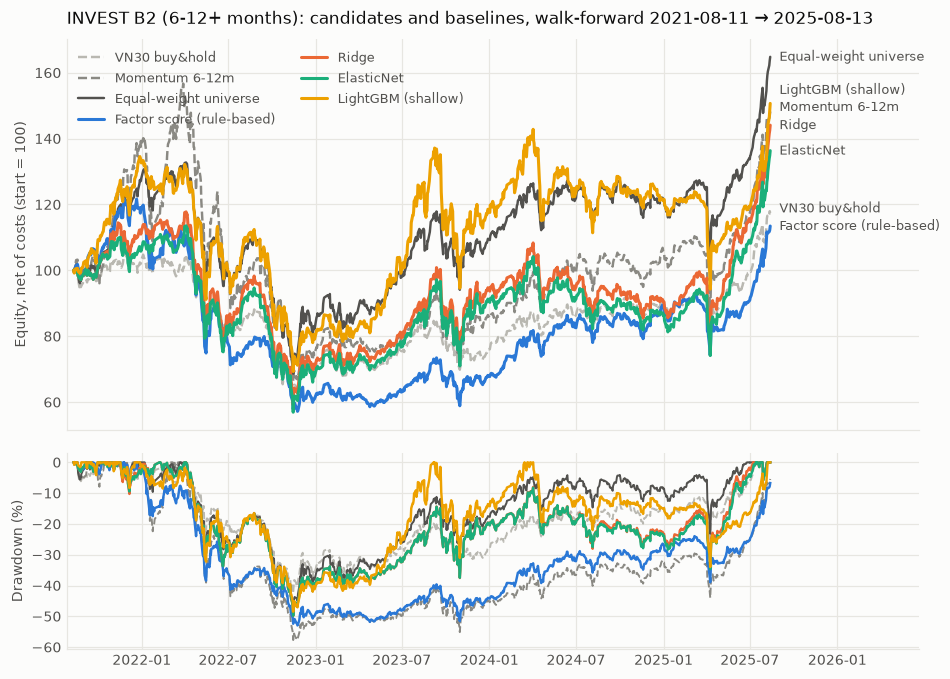
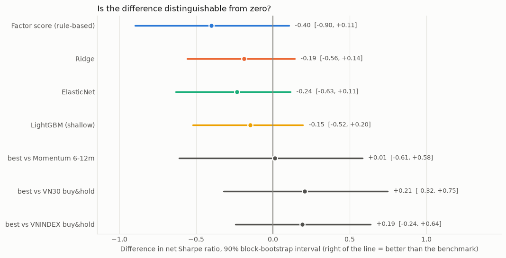
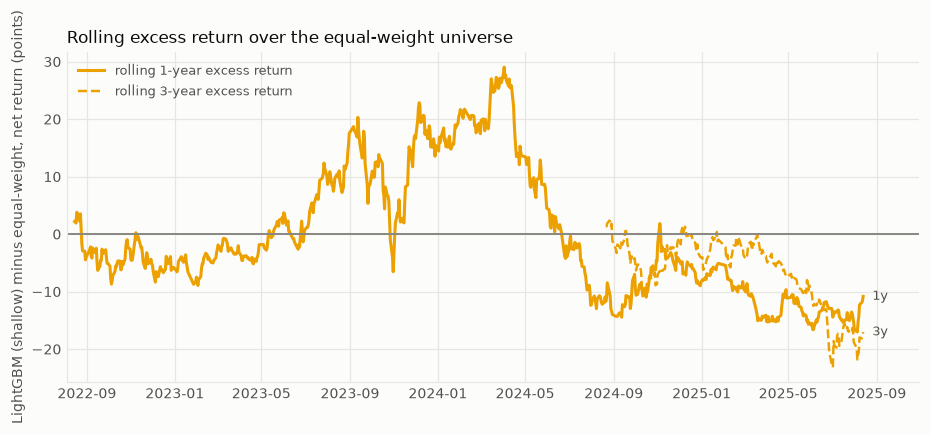

# INVEST B2 (6-12+ months) — walk-forward 2021-08-11 → 2025-08-13

Universe **LARGE50** · run `4da8d6a0750eb854` · dataset `2bbbd6815f11` · horizon 126 sessions · rebalance quarterly in 2 tranches · top 10, equal weight, cap 15% · held-out period 2025-09-19 → 2026-09-18 **untouched**. Prices only: no fundamental data is used.

## Verdict

**INVEST B2 (6-12+ months) does not beat the baselines after costs.** The best candidate by net Sharpe is LightGBM (shallow): net Sharpe 0.51 (90% interval -0.35 … 1.50), CAGR 10.8%, max drawdown -48.5%; equal_weight over the same window: 0.66. 4 of 5 pre-registered criteria fail. The held-out period stays closed and nothing is tuned further.

| pre-registered criterion (for the best candidate) | value | threshold | detail | met |
| --- | --- | --- | --- | --- |
| net Sharpe above every portfolio baseline | 0.509 | 0.657 | best baseline: equal_weight | **no** |
| reality check p <= 0.1 (Sharpe vs equal-weight, 4 candidates) | 0.967 | 0.100 | best by the check: lgbm | **no** |
| rank IC t-statistic >= 2.0 | 0.147 | 2.000 | mean IC 0.0135 | **no** |
| share of rolling 1y windows ahead of equal-weight >= 0.6 | 0.362 | 0.600 | 748 overlapping windows | **no** |
| net Sharpe > 0 at 2x costs | 0.458 | 0.000 |  | yes |

## Results (net of costs unless stated; baselines re-run over the same window, engine and costs)

| strategy | CAGR | Sharpe | Sortino | max DD | Calmar | turnover ×/yr | CAGR gross | cost drag (points/yr) | Sharpe at 2× costs |
| --- | --- | --- | --- | --- | --- | --- | --- | --- | --- |
| Factor score (rule-based) | 3.2% | 0.25 | 0.34 | -53% | 0.06 | 1.9 | 4.5% | 1.3 | 0.19 |
| Ridge | 9.5% | 0.47 | 0.64 | -50% | 0.19 | 2.3 | 11.3% | 1.8 | 0.42 |
| ElasticNet | 8.0% | 0.42 | 0.57 | -50% | 0.16 | 2.3 | 9.7% | 1.7 | 0.37 |
| **LightGBM (shallow)** (best) | 10.8% | 0.51 | 0.69 | -49% | 0.22 | 2.4 | 12.3% | 1.6 | 0.46 |
| Equal-weight universe | 13.3% | 0.66 | 0.88 | -48% | 0.28 | 0.2 | 13.4% | 0.1 | 0.65 |
| Momentum 6-12m | 10.3% | 0.50 | 0.66 | -58% | 0.18 | 3.1 | 12.6% | 2.3 | 0.42 |
| Momentum 6-12m inv-vol | 8.2% | 0.44 | 0.58 | -57% | 0.14 | 3.3 | 11.0% | 2.8 | 0.37 |
| Momentum 10d | 9.5% | 0.48 | 0.64 | -44% | 0.22 | 25.4 | 29.8% | 20.2 | -0.09 |
| Mean reversion | -22.2% | -0.89 | -1.15 | -77% | -0.29 | 28.4 | -6.3% | 15.8 | -1.55 |
| VNINDEX buy&hold | 4.3% | 0.32 | 0.42 | -40% | 0.11 | 0.0 | 4.4% | 0.1 | 0.31 |
| VN30 buy&hold | 4.1% | 0.30 | 0.41 | -42% | 0.10 | 0.0 | 4.2% | 0.1 | 0.30 |

Random top-10 portfolios on the same quarterly schedule (20 seeds): net Sharpe median 0.57, 5th–95th percentile 0.42 … 0.72.

## Confidence intervals (stationary block bootstrap)

2000 resamples, mean block 21 sessions, 90% two-sided intervals, on 999 daily returns. Differences are computed on the same resampled days as the benchmark (paired).

| candidate | Sharpe | CAGR | max drawdown | Sharpe − equal-weight | resamples with a positive difference |
| --- | --- | --- | --- | --- | --- |
| Factor score (rule-based) | 0.25 [-0.63, 1.24] | 3.2% [-16.6%, 26.1%] | -53.0% [-65.3%, -23.2%] | -0.40 [-0.90, 0.11] | 10% |
| Ridge | 0.47 [-0.35, 1.36] | 9.6% [-13.8%, 38.5%] | -49.8% [-64.5%, -25.5%] | -0.19 [-0.56, 0.14] | 17% |
| ElasticNet | 0.42 [-0.41, 1.32] | 8.1% [-15.1%, 36.5%] | -49.8% [-65.3%, -25.6%] | -0.24 [-0.63, 0.11] | 14% |
| LightGBM (shallow) | 0.51 [-0.35, 1.50] | 10.9% [-13.7%, 42.8%] | -48.5% [-66.2%, -27.1%] | -0.15 [-0.52, 0.20] | 25% |

**White's reality check** over the 4 candidates against equal-weight (Sharpe difference): largest observed difference -0.15 (LightGBM (shallow)), **p = 0.967** — the probability of seeing a best-of-4 difference this large if none of them had any edge. Pre-registered threshold 0.1.

## Rolling windows

| candidate | window | windows | share ahead of equal-weight | median excess | worst excess | median return | share with a loss |
| --- | --- | --- | --- | --- | --- | --- | --- |
| Factor score (rule-based) | 1y | 748 | 39% | -10.7% | -39.8% | 7.0% | 42% |
| Factor score (rule-based) | 3y | 244 | 0% | -19.3% | -44.6% | -17.2% | 77% |
| Ridge | 1y | 748 | 14% | -5.1% | -16.9% | -0.3% | 50% |
| Ridge | 3y | 244 | 9% | -14.1% | -33.5% | -11.1% | 74% |
| ElasticNet | 1y | 748 | 14% | -5.4% | -18.7% | -1.2% | 53% |
| ElasticNet | 3y | 244 | 3% | -14.8% | -38.0% | -13.4% | 75% |
| LightGBM (shallow) | 1y | 748 | 36% | -3.7% | -17.0% | 2.8% | 46% |
| LightGBM (shallow) | 3y | 244 | 7% | -4.8% | -23.2% | 3.1% | 43% |

* LightGBM (shallow) against Momentum 6-12m, 1-year windows: ahead in 55% of 748 (overlapping) windows, median excess 3.5%.
* LightGBM (shallow) against Momentum 6-12m, 3-year windows: ahead in 89% of 244 (overlapping) windows, median excess 15.4%.
* LightGBM (shallow) against VN30 buy&hold, 1-year windows: ahead in 49% of 748 (overlapping) windows, median excess -1.2%.
* LightGBM (shallow) against VN30 buy&hold, 3-year windows: ahead in 77% of 244 (overlapping) windows, median excess 5.3%.

Rolling windows overlap almost completely, so their number overstates the evidence; a 3-year window needs 3 years of out-of-sample data and there are only a few.

## Ranking quality

Daily cross-sectional Spearman IC between the score and the realised forward return over 126 sessions (only labels that end before the held-out period). t-statistic with an effective sample of days / 126.

| candidate | days | mean IC | std | ICIR | t-stat | days IC>0 |
| --- | --- | --- | --- | --- | --- | --- |
| Factor score (rule-based) | 898 | -0.0408 | 0.305 | -0.13 | -0.36 | 53% |
| Ridge | 898 | 0.0844 | 0.203 | 0.42 | 1.11 | 68% |
| ElasticNet | 898 | 0.0858 | 0.203 | 0.42 | 1.13 | 68% |
| LightGBM (shallow) | 898 | 0.0135 | 0.246 | 0.06 | 0.15 | 52% |

Mean IC by fold:

| fold | test window | fit rows | val rows | LightGBM trees kept | Factor score (rule-based) | Ridge | ElasticNet | LightGBM (shallow) |
| --- | --- | --- | --- | --- | --- | --- | --- | --- |
| 0 | 2021-08-11 → 2022-02-11 | 11763 | 6095 | 1 | -0.077 | 0.029 | 0.038 | 0.052 |
| 1 | 2022-02-14 → 2022-08-10 | 17855 | 6116 | 51 | 0.090 | 0.034 | 0.036 | 0.131 |
| 2 | 2022-08-11 → 2023-02-13 | 23950 | 6126 | 2 | -0.380 | 0.155 | 0.153 | -0.140 |
| 3 | 2023-02-14 → 2023-08-10 | 30066 | 6250 | 1 | -0.307 | 0.067 | 0.067 | 0.402 |
| 4 | 2023-08-11 → 2024-02-06 | 36191 | 6250 | 49 | 0.277 | 0.022 | 0.023 | 0.044 |
| 5 | 2024-02-07 → 2024-08-12 | 42441 | 6250 | 1 | 0.232 | 0.031 | 0.032 | -0.227 |
| 6 | 2024-08-13 → 2025-02-13 | 48691 | 6250 | 10 | -0.101 | 0.165 | 0.165 | -0.115 |
| 7 | 2025-02-14 → 2025-08-13 | 54941 | 6250 | 3 | -0.146 | 0.561 | 0.562 | -0.268 |

In fold(s) 0, 2, 3, 5, 7 early stopping kept 5 trees or fewer: the shallow LightGBM found almost nothing on the validation window there, so its scores are close to constant (ties are broken by instrument id) and its portfolio in those windows is close to arbitrary.

Embargo = 126 sessions (the label horizon); samples purged by the end date of the 126-session label. The four candidates are compared on the same folds; the ridge / elastic-net penalty was chosen once on the first fold: ridge {"alpha": 1.0, "validation_ic": -0.28119}; elasticnet {"alpha": 0.0005, "l1_ratio": 0.2, "validation_ic": -0.28724}.

Grid caveat: the chosen penalty of ridge and elasticnet sits at the edge of the pre-registered grid; the best validation IC of ridge and elasticnet was not even positive, so the selection among grid points is mostly noise. The grid was fixed in advance and is not widened after the fact.

## Scenario quantiles (bear / base / bull) at the horizon

q10 / q50 / q90 of the 126-session forward return from three shallow quantile boosters (sorted so they never cross): observed share below each = 17.2% / 60.1% / 93.9% (nominal 10 / 50 / 90%); the q10–q90 band covers 76.7% (nominal 80%), mean width 86.8%. Pinball loss model / constant: q10 0.0645 / 0.0450, q50 0.1177 / 0.1036, q90 0.0845 / 0.0614. Overlapping labels make these intervals less reliable than the sample size suggests.

**The scenario quantiles do not beat a constant** at q10, q50, q90 (pinball loss above that of the pooled out-of-sample quantile, itself a yardstick that sees the whole sample): read the bear / base / bull figures as a rough spread of outcomes, not as a forecast.

## Variants of the best candidate (information only; nothing here chose the configuration)

| variant | CAGR | Sharpe | Sortino | max DD | Calmar | turnover | Sharpe gross | Sharpe at 2× costs |
| --- | --- | --- | --- | --- | --- | --- | --- | --- |
| primary: K = 10, equal, 2 tranches | 10.8% | 0.51 | 0.69 | -49% | 0.22 | 2.4 | 0.56 | 0.46 |
| K = 8 | 9.6% | 0.47 | 0.64 | -51% | 0.19 | 2.4 | 0.53 | 0.42 |
| K = 10 | 10.8% | 0.51 | 0.69 | -49% | 0.22 | 2.4 | 0.56 | 0.46 |
| K = 15 | 8.2% | 0.44 | 0.59 | -47% | 0.18 | 2.1 | 0.50 | 0.40 |
| weights: inverse_vol | 11.3% | 0.54 | 0.73 | -45% | 0.25 | 2.3 | 0.59 | 0.48 |
| weights: risk_parity | 10.6% | 0.52 | 0.70 | -45% | 0.24 | 2.4 | 0.57 | 0.45 |
| weights: min_variance | 10.4% | 0.51 | 0.70 | -41% | 0.26 | 2.4 | 0.57 | 0.47 |
| weights: hrp | 11.6% | 0.55 | 0.75 | -44% | 0.27 | 2.4 | 0.61 | 0.49 |
| 1 tranche(s) | 15.0% | 0.64 | 0.88 | -42% | 0.36 | 2.3 | 0.70 | 0.59 |
| 3 tranche(s) | 8.1% | 0.42 | 0.57 | -51% | 0.16 | 2.4 | 0.47 | 0.37 |
| regime filter (index < SMA200 ⇒ 50% of the stock weights, rest cash) | 9.9% | 0.51 | 0.69 | -38% | 0.26 | 2.1 | 0.55 | 0.46 |

These variants differ by amounts of the same size as the bootstrap intervals above; a difference between two rows is not evidence that one setting is better.

The index was below its 200-day average on 37% of the sessions in the window (VN30, or VNINDEX where VN30 has no 200-day average yet).

**Periodic contribution (DCA)** of 10 M VND on the first session of each month, invested at each strategy's own daily return (an approximation: no lot rounding on the marginal contribution; costs are inside the returns):

| portfolio | paid in | final value | gain | money-weighted return / yr |
| --- | --- | --- | --- | --- |
| best candidate | 490 M | 671 M | 181 M | 16.0% |
| equal-weight | 490 M | 738 M | 248 M | 21.1% |
| VN30 buy&hold | 490 M | 676 M | 186 M | 16.5% |

## Signal outputs and thesis-break conditions

Each stored signal carries its score, the bear / base / bull quantiles, the horizon, the factor contributions and three thesis-break flags: close below the 200-day average; relative strength (rank of 6-month momentum in the universe) below 0.4; drawdown from the 252-session high deeper than 25%. Among the 150 holdings the best candidate would have taken at rebalance dates, the forward 126-session return was:

| flag | flagged: n | flagged: mean return | flagged: share negative | clear: n | clear: mean return | clear: share negative |
| --- | --- | --- | --- | --- | --- | --- |
| below SMA200 | 55 | 4.8% | 47% | 95 | 7.1% | 42% |
| weak relative strength | 54 | 9.0% | 52% | 96 | 4.8% | 40% |
| deep drawdown | 40 | 10.4% | 40% | 110 | 4.8% | 45% |
| any flag | 79 | 7.8% | 46% | 71 | 4.6% | 42% |

Holdings overlap from one rebalance to the next, so these are descriptive, not independent tests. The flags are an output for the reader; they are not a trading rule in the backtest.

Stored signals (`predictions.details`, latest rebalance date of the last fold model, best candidate):

* 2025-07-01 · ACB · rank 1 · score 0.509 · bear/base/bull -27% / 8% / 44% over 126 sessions · thesis-break triggers: none · contributions: vol_126=0.23 → -0.001; mom_12m=0.01 → -0.001; dbeta_126=0.6 → -0.000; dd_252=-0.04 → -0.000
* 2025-07-01 · BID · rank 2 · score 0.509 · bear/base/bull -26% / 10% / 52% over 126 sessions · thesis-break triggers: below_sma200, weak_relative_strength · contributions: vol_126=0.25 → -0.001; mom_12m=-0.12 → -0.001; dbeta_126=0.5 → -0.000; dd_252=-0.12 → -0.000

## Fundamentals

no fundamental columns in the dataset: the INVEST models ran on prices only. The pipeline is ready for them: if the dataset gains columns starting with `fund_`, `invest run` re-fits the learned candidates with and without them and this section reports the difference in out-of-sample rank IC.

## Reproducibility and records

Models (`invest_b2_<candidate>_fNN` per fold, `_final` on all development data) are registered in `models` with status `candidate`; 3,388 predictions (rebalance dates only) are in `predictions` with scenario quantiles, horizon, thesis flags and contributions in `details`. The hyper-parameter grid (one row per point) is in `experiments` (`invest:grid:f5113f80321c74be:NNN`), the pre-registration in `invest:preregistration`. Re-running with unchanged data and configuration reproduces identical model files and reuses the rows.

## Assumptions and limits

* Everything in [BASELINES.md](BASELINES.md) applies: universe look-ahead/survivorship (LARGE50 = today's 50 most traded names), dividend-adjusted vendor prices, inferred price bands, T+2 for the whole period, brief-default costs (not re-verified), no market impact.
* **Small sample.** About 4 years of out-of-sample returns, up to 50 names, one path of history, and labels of 63 / 126 sessions that overlap almost completely: the number of *independent* observations is a handful. The intervals above are the honest way to read the point estimates.
* The comparison window starts at the first test session (≥ 500 training sessions + an embargo equal to the horizon), later than the Phase 4 baselines' window; the baselines were re-run over it.
* The regime filter uses VN30 only from when it has a 200-day average (VN30 exists from 2020-05); before that VNINDEX.
* DCA is a return-series approximation (marginal contributions are assumed to earn the strategy's return, without lot rounding).
* Forward-return labels that would end inside the held-out period are excluded from every IC / quantile figure; the portfolio backtests stop at the last development session. The held-out period was not used for any choice.
