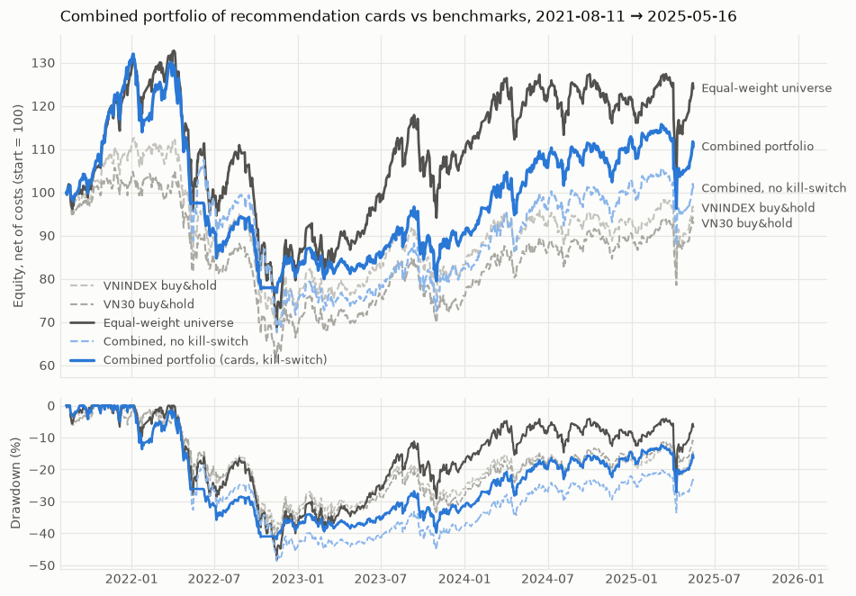
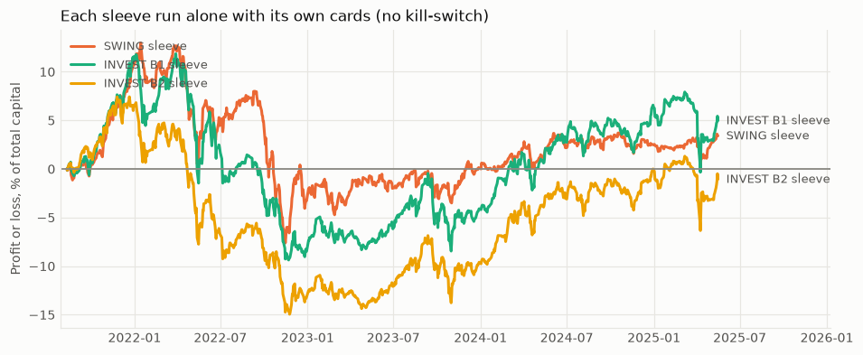
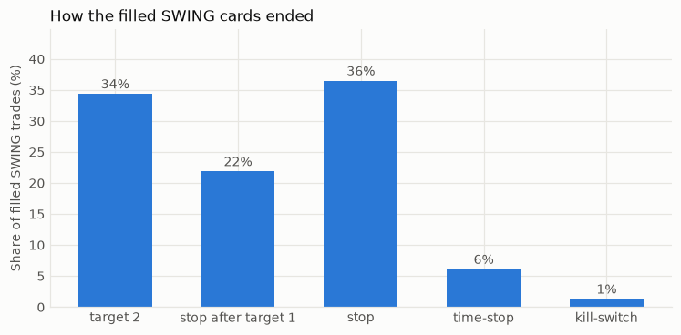
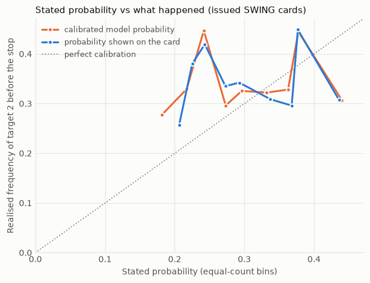

# Recommendation cards and the combined portfolio — backtest 2021-08-11 → 2025-05-16

Universe **LARGE50** · run `353689f549f9b509` · held-out period 2025-09-19 → 2026-09-18 **untouched**. Every card is a statistical estimate, not a promise; paper trading only. The models behind the cards have NOT passed their pre-registered criteria: swing: FAILED (1 criteria); invest b1: FAILED (4 criteria); invest b2: FAILED (4 criteria). Every card says so.

## What a card contains

`recommendations` row + JSON (`artifacts/reco/`) + Vietnamese text. Sections, all mandatory for a BUY / WATCH card (otherwise the card is NO_TRADE with the reason):

| part | SWING | INVEST B1 / B2 |
| --- | --- | --- |
| identity | symbol, strategy, creation date, valid-until session, action (MUA / THEO DÕI / KHÔNG GIAO DỊCH), model id, universe id | same |
| entry | zone [low, high] on the HOSE tick grid inside the next session's ±7% band; order type: pullback limit / breakout buy-stop / ATO; cancel conditions (opens above the zone: not chased; expires after N sessions) | limit at the zone's high, no chasing; 2 tranches, the second a few sessions later if the stock is still in the top 10 |
| exits | stop, target 1 and 2 with the probability of touching, reward:risk (no card below 1.5), capped under the nearest resistance | bear / base / bull price zones (q10 / q50 / q90) and thesis-break conditions instead of a hard stop |
| holding | expected (median) and 75th percentile, maximum (time-stop), earliest sale under T+2 | horizon, maximum, next review / rebalance date, earliest sale under T+2 |
| confidence | calibrated probability, the probability actually SHOWN (and why), score percentile, similar past signals with n (flagged when small), grade of the evidence | score percentile, past picks with n, evidence grade |
| rationale | template text from real numbers: top SHAP contributions with their values, trend / RSI / volume / relative strength / regime; ALWAYS risks and the conditions that void the signal | same, with the factor contributions |
| sizing | loss-if-stop = 0.75% of capital, per-name cap 5%, whole lots of 100 | target weight of the sleeve, whole lots, loss if the bear scenario materialises |

Rules (`config/default.yaml`, section `reco`; fixed before this backtest): stop 1.0 ATR, target 1 / 2 = 1.0 / 2.0 ATR, min R:R 1.5, time-stop 10 sessions, at most 6 SWING positions, risk per trade 0.75%, sleeves 30% SWING / 70% INVEST, ≤ 15% of capital in one name over all sleeves, kill-switch at 20% drawdown (21 sessions flat).

## Cards issued on 2026-09-18

Produced by `python -m predict_stock reco generate` from the final models; BUY and WATCH cards are in the `recommendations` table, the rest are listed with their reason. The as-of date lies inside the held-out period only in the sense that these are forward-looking cards: no return after it is used or evaluated anywhere.

```
THẺ KHUYẾN NGHỊ — FPT — SWING — MUA
Ngày tạo 18/09/2026 · hiệu lực đến hết 23/09/2026 · mô hình swing_lgbm_final (#24) · universe #2
⚠ Mô hình CHƯA vượt baseline sau chi phí trong kiểm chứng walk-forward tiền đăng ký (1/5 tiêu chí không đạt): khuyến nghị chỉ mang tính nghiên cứu / giao dịch giả lập.

1. GIÁ VÀO LỆNH
   Vùng vào: 64.200 – 64.900 (giá tham chiếu phiên kế tiếp 65.180; biên độ 60.700 – 69.700).
   Loại lệnh: lệnh giới hạn (LO) chờ điều chỉnh.
   Hủy nếu: lệnh giới hạn không bao giờ khớp cao hơn giá giới hạn; nếu giá không điều chỉnh về vùng thì không mua
   Hủy nếu: hết hiệu lực sau 3 phiên (đến hết 23/09/2026)

2. TARGET & CẮT LỖ
   Giá vào tham chiếu 64.600 · Stop-loss 63.000 (-2,5%)
   Target 1: 66.200 (+2,5%), xác suất chạm ước lượng 60% — bán 50% vị thế, dời stop về giá vào
   Target 2: 67.700 (+4,8%), xác suất chạm trước stop (đã hiệu chỉnh) 41%
   R:R tới target 2 = 1,94 (tới target 1 = 1,00); ngưỡng tối thiểu 1,50.

3. THỜI GIAN NẮM GIỮ
   Kỳ vọng (trung vị) 4 phiên, 75% trường hợp trong 6 phiên; tối đa 10 phiên (time-stop); sớm nhất bán được (T+2): 23/09/2026.

4. ĐỘ TIN CẬY
   Xác suất mô hình (đã hiệu chỉnh): 40% · xác suất HIỂN THỊ: 41% (tỷ lệ thắng lịch sử của nhóm tương tự, n = 768; xác suất mô hình không được dùng làm con số chính)
   Điểm xếp hạng 0,527 — hạng 4/50 (phân vị 94% trong rổ hôm nay).
   Nhóm tín hiệu tương tự trong quá khứ (n = 768): thắng 41%, chạm target 1 60%, chạm stop 50%, hết hạn 9%.
   Xếp hạng độ tin cậy hiển thị: THẤP — AUC ngoài mẫu trong quá khứ chỉ 0,51 (< 0,55): xác suất chưa phân biệt được tín hiệu tốt và xấu

5. LÝ DO
   • Mô hình xếp FPT hạng 4/50 hôm nay (điểm 0,527). Các yếu tố đóng góp lớn nhất (TreeSHAP): MACD (% giá) = 1,17% → nâng điểm 0,005; thứ hạng lợi suất 5 phiên trong rổ = 0,26 → nâng điểm 0,005; thứ hạng z-score trong rổ = 0,48 → nâng điểm 0,003; khoảng cách tới đáy 20 phiên = 5,1% → giảm điểm 0,003.
   • Bối cảnh: giá dưới SMA200 (72.617) 10,2%; trên SMA50 (63.544); RSI(14) = 50; khối lượng 3,3 lần trung bình 20 phiên; sức mạnh tương đối 5 phiên so với chỉ số -2,8%, 10 phiên -0,5%; chỉ số tham chiếu đang trên SMA200.
   • Cách vào: pullback — vùng 64.200–64.900; stop 63.000 = 1,0 ATR dưới giá vào; ATR(14) = 1.526 (2,3% giá).
   Rủi ro / lập luận ngược:
   ▸ Xác suất mô hình chưa đáng tin (AUC ngoài mẫu trong quá khứ chỉ 0,51 (< 0,55): xác suất chưa phân biệt được tín hiệu tốt và xấu); dùng tỷ lệ lịch sử của nhóm tương tự làm tham chiếu.
   ▸ Mô hình chưa vượt các baseline (giữ đều cả rổ, momentum) sau chi phí trong kiểm chứng walk-forward; một tín hiệu đơn lẻ có thể chỉ là nhiễu.
   ▸ T+2: cổ phiếu mua hôm nay không bán được trong 2 phiên đầu, kể cả khi giá xuyên stop — rủi ro gap thực tế lớn hơn mức stop đã nêu.
   Tín hiệu mất hiệu lực khi:
   ✗ Đóng cửa dưới stop-loss 63.000 (hoặc thủng stop trong phiên khi đã bán được).
   ✗ Sau 10 phiên chưa chạm target thì thoát theo time-stop.
   ✗ Sau khi đạt target 1 mà giá quay về giá vào: thoát phần còn lại (stop dời về hòa vốn).
   ✗ Hủy lệnh sau 3 phiên chưa khớp.

6. QUẢN TRỊ VỐN
   Tỷ trọng 4,54% vốn (≈ 700 cổ phiếu = 7 lô, vốn tham chiếu 1.0 tỷ).
   Nếu chạm stop mất ≈ 0,11% vốn (mục tiêu rủi ro 0,75%).
   Giới hạn áp dụng: trần 5,0% vốn cho mỗi mã (theo rủi ro sẽ là 30,3%)

Đây là ước lượng thống kê từ mô hình, không phải cam kết hay lời khuyên đầu tư; chỉ dùng cho nghiên cứu và giao dịch giả lập (paper trading).
```

```
THẺ KHUYẾN NGHỊ — ACB — INVEST B1 — MUA
Ngày tạo 18/09/2026 · hiệu lực đến hết 25/09/2026 · mô hình invest_b1_factor_final (#57) · universe #2
⚠ Mô hình CHƯA vượt baseline sau chi phí trong kiểm chứng walk-forward tiền đăng ký (4/5 tiêu chí không đạt): khuyến nghị chỉ mang tính nghiên cứu / giao dịch giả lập.

1. GIÁ VÀO LỆNH
   Vùng vào: 21.450 – 22.000 (giá tham chiếu phiên kế tiếp 21.900; biên độ 20.400 – 23.400).
   Loại lệnh: lệnh giới hạn (LO) chờ điều chỉnh.
   Hủy nếu: hết hiệu lực sau 5 phiên (đến hết 25/09/2026) nếu chưa khớp
   Hủy nếu: lệnh giới hạn không bao giờ khớp cao hơn giá giới hạn; không đuổi giá
   Đợt 1: 50% khối lượng — ngay khi khuyến nghị có hiệu lực
   Đợt 2: 50% khối lượng — 5 phiên sau đợt 1, nếu mã vẫn thuộc top-10

2. KỊCH BẢN & ĐIỀU KIỆN PHÁ VỠ LUẬN ĐIỂM (không có stop cứng)
   Bear (q10) sau 63 phiên: -14,8% → khoảng giá 18.450
   Base (q50) sau 63 phiên: +1,5% → khoảng giá 22.000
   Bull (q90) sau 63 phiên: +24,9% → khoảng giá 27.150
   Điều kiện phá vỡ luận điểm (rà soát và cân nhắc thoát khi xảy ra):
   - Giá đóng cửa dưới SMA200 (21.253).
   - Sức mạnh tương đối suy giảm: thứ hạng động lượng 6 tháng trong rổ rơi dưới 0,40 (hiện 0,84).
   - Sụt giảm quá 15% từ đỉnh 252 phiên (đỉnh 23.850 → dưới 20.272).
   - Mã rơi khỏi nhóm 10 mã đầu bảng xếp hạng ở kỳ tái cơ cấu kế tiếp.
   Mức tham chiếu rủi ro (kịch bản bear, KHÔNG phải lệnh stop): 18.450

3. THỜI GIAN NẮM GIỮ
   Kỳ vọng (trung vị) 63 phiên; tối đa 63 phiên (rà soát lại luận điểm); sớm nhất bán được (T+2): 23/09/2026.
   Ngày rà soát/tái cơ cấu kế tiếp: 01/10/2026.

4. ĐỘ TIN CẬY
   Xác suất mô hình (đã hiệu chỉnh): n/a · xác suất HIỂN THỊ: không áp dụng (INVEST không dùng xác suất chạm target)
   Điểm xếp hạng 0,816 — hạng 5/50 (phân vị 92% trong rổ hôm nay).
   Các lần chọn top-K trước đây của mô hình (n = 9997, chồng lấp): lợi suất dương 54%, vượt trung vị 50%.
   Xếp hạng độ tin cậy hiển thị: KHÔNG ÁP DỤNG — INVEST không công bố xác suất chạm mức giá; tham chiếu duy nhất là các lần chọn top-K trước đây của mô hình (n = 9997: lợi suất dương 54%, vượt trung vị 50%, lợi suất trung bình +2,4%; các quan sát chồng lấp nhiều nên số trường hợp độc lập ít hơn n rất nhiều)

5. LÝ DO
   • ACB xếp hạng 5/50 theo điểm 0,816 (factor). Đóng góp lớn nhất: thứ hạng mức sụt giảm (nông = tốt) = 0,88 (+0,076); thứ hạng động lượng 6 tháng trong rổ = 0,84 (+0,068); thứ hạng biến động (thấp = tốt) = 0,20 (+0,060); thứ hạng giá so với SMA200 = 0,80 (+0,060); thứ hạng động lượng 12 tháng trong rổ = 0,76 (+0,052).
   • Bối cảnh: giá trên SMA200 3,0%; đang cách đỉnh 252 phiên 7,8%; động lượng 6 tháng +10,2%; biến động 126 phiên 25%/năm; chỉ số tham chiếu trên SMA200.
   • Kịch bản 63 phiên: bear -14,8%, base +1,5%, bull +24,9% (phân vị 10/50/90 của mô hình).
   Rủi ro / lập luận ngược:
   ▸ Kịch bản bear/base/bull là phân vị thống kê, không phải dự báo: trong kiểm chứng ngoài mẫu chúng không tốt hơn một phân vị hằng số.
   ▸ Chiến lược INVEST chưa vượt danh mục giữ đều cả rổ sau chi phí trong kiểm chứng walk-forward (khoảng tin cậy Sharpe bao trùm 0).
   Tín hiệu mất hiệu lực khi:
   ✗ Giá đóng cửa dưới SMA200 (21.253).
   ✗ Sức mạnh tương đối suy giảm: thứ hạng động lượng 6 tháng trong rổ rơi dưới 0,40 (hiện 0,84).
   ✗ Sụt giảm quá 15% từ đỉnh 252 phiên (đỉnh 23.850 → dưới 20.272).
   ✗ Mã rơi khỏi nhóm 10 mã đầu bảng xếp hạng ở kỳ tái cơ cấu kế tiếp.
   ✗ Hủy lệnh nếu sau 5 phiên chưa khớp.

6. QUẢN TRỊ VỐN
   Tỷ trọng 1,54% vốn (≈ 700 cổ phiếu = 7 lô, vốn tham chiếu 1.0 tỷ) — đợt 1/2, tỷ trọng mục tiêu cuối 3,50%.
   Nếu rơi về kịch bản bear mất ≈ 0,23% vốn (ước lượng thống kê, không có stop cứng).

Đây là ước lượng thống kê từ mô hình, không phải cam kết hay lời khuyên đầu tư; chỉ dùng cho nghiên cứu và giao dịch giả lập (paper trading).
```

```
THẺ KHUYẾN NGHỊ — ACB — INVEST B2 — MUA
Ngày tạo 18/09/2026 · hiệu lực đến hết 25/09/2026 · mô hình invest_b2_factor_final (#93) · universe #2
⚠ Mô hình CHƯA vượt baseline sau chi phí trong kiểm chứng walk-forward tiền đăng ký (4/5 tiêu chí không đạt): khuyến nghị chỉ mang tính nghiên cứu / giao dịch giả lập.

1. GIÁ VÀO LỆNH
   Vùng vào: 21.450 – 22.000 (giá tham chiếu phiên kế tiếp 21.900; biên độ 20.400 – 23.400).
   Loại lệnh: lệnh giới hạn (LO) chờ điều chỉnh.
   Hủy nếu: hết hiệu lực sau 5 phiên (đến hết 25/09/2026) nếu chưa khớp
   Hủy nếu: lệnh giới hạn không bao giờ khớp cao hơn giá giới hạn; không đuổi giá
   Đợt 1: 50% khối lượng — ngay khi khuyến nghị có hiệu lực
   Đợt 2: 50% khối lượng — 10 phiên sau đợt 1, nếu mã vẫn thuộc top-10

2. KỊCH BẢN & ĐIỀU KIỆN PHÁ VỠ LUẬN ĐIỂM (không có stop cứng)
   Bear (q10) sau 126 phiên: -23,3% → khoảng giá 16.600
   Base (q50) sau 126 phiên: +6,0% → khoảng giá 23.000
   Bull (q90) sau 126 phiên: +54,5% → khoảng giá 33.550
   Điều kiện phá vỡ luận điểm (rà soát và cân nhắc thoát khi xảy ra):
   - Giá đóng cửa dưới SMA200 (21.253).
   - Sức mạnh tương đối suy giảm: thứ hạng động lượng 6 tháng trong rổ rơi dưới 0,40 (hiện 0,84).
   - Sụt giảm quá 25% từ đỉnh 252 phiên (đỉnh 23.850 → dưới 17.888).
   - Mã rơi khỏi nhóm 10 mã đầu bảng xếp hạng ở kỳ tái cơ cấu kế tiếp.
   Mức tham chiếu rủi ro (kịch bản bear, KHÔNG phải lệnh stop): 16.600

3. THỜI GIAN NẮM GIỮ
   Kỳ vọng (trung vị) 126 phiên; tối đa 126 phiên (rà soát lại luận điểm); sớm nhất bán được (T+2): 23/09/2026.
   Ngày rà soát/tái cơ cấu kế tiếp: 01/10/2026.

4. ĐỘ TIN CẬY
   Xác suất mô hình (đã hiệu chỉnh): n/a · xác suất HIỂN THỊ: không áp dụng (INVEST không dùng xác suất chạm target)
   Điểm xếp hạng 0,816 — hạng 5/50 (phân vị 92% trong rổ hôm nay).
   Các lần chọn top-K trước đây của mô hình (n = 10000, chồng lấp): lợi suất dương 60%, vượt trung vị 53%.
   Xếp hạng độ tin cậy hiển thị: KHÔNG ÁP DỤNG — INVEST không công bố xác suất chạm mức giá; tham chiếu duy nhất là các lần chọn top-K trước đây của mô hình (n = 10000: lợi suất dương 60%, vượt trung vị 53%, lợi suất trung bình +6,7%; các quan sát chồng lấp nhiều nên số trường hợp độc lập ít hơn n rất nhiều)

5. LÝ DO
   • ACB xếp hạng 5/50 theo điểm 0,816 (factor). Đóng góp lớn nhất: thứ hạng mức sụt giảm (nông = tốt) = 0,88 (+0,076); thứ hạng động lượng 6 tháng trong rổ = 0,84 (+0,068); thứ hạng biến động (thấp = tốt) = 0,20 (+0,060); thứ hạng giá so với SMA200 = 0,80 (+0,060); thứ hạng động lượng 12 tháng trong rổ = 0,76 (+0,052).
   • Bối cảnh: giá trên SMA200 3,0%; đang cách đỉnh 252 phiên 7,8%; động lượng 6 tháng +10,2%; biến động 126 phiên 25%/năm; chỉ số tham chiếu trên SMA200.
   • Kịch bản 126 phiên: bear -23,3%, base +6,0%, bull +54,5% (phân vị 10/50/90 của mô hình).
   Rủi ro / lập luận ngược:
   ▸ Kịch bản bear/base/bull là phân vị thống kê, không phải dự báo: trong kiểm chứng ngoài mẫu chúng không tốt hơn một phân vị hằng số.
   ▸ Chiến lược INVEST chưa vượt danh mục giữ đều cả rổ sau chi phí trong kiểm chứng walk-forward (khoảng tin cậy Sharpe bao trùm 0).
   Tín hiệu mất hiệu lực khi:
   ✗ Giá đóng cửa dưới SMA200 (21.253).
   ✗ Sức mạnh tương đối suy giảm: thứ hạng động lượng 6 tháng trong rổ rơi dưới 0,40 (hiện 0,84).
   ✗ Sụt giảm quá 25% từ đỉnh 252 phiên (đỉnh 23.850 → dưới 17.888).
   ✗ Mã rơi khỏi nhóm 10 mã đầu bảng xếp hạng ở kỳ tái cơ cấu kế tiếp.
   ✗ Hủy lệnh nếu sau 5 phiên chưa khớp.

6. QUẢN TRỊ VỐN
   Tỷ trọng 1,54% vốn (≈ 700 cổ phiếu = 7 lô, vốn tham chiếu 1.0 tỷ) — đợt 1/2, tỷ trọng mục tiêu cuối 3,50%.
   Nếu rơi về kịch bản bear mất ≈ 0,36% vốn (ước lượng thống kê, không có stop cứng).

Đây là ước lượng thống kê từ mô hình, không phải cam kết hay lời khuyên đầu tư; chỉ dùng cho nghiên cứu và giao dịch giả lập (paper trading).
```

```
[không phát hành] VIC (INVEST_B1): vốn phân bổ không đủ một lô 100 cổ phiếu
```

```
[không phát hành] VIC (INVEST_B2): vốn phân bổ không đủ một lô 100 cổ phiếu
```

```
[không phát hành] DGW (SWING): R:R tới target 2 = 1,26 thấp hơn ngưỡng 1,50
```

## Backtest of the cards, exactly as issued

5,375 BUY cards were issued (4,965 SWING, 250 INVEST B1, 160 INVEST B2 incl. second tranches), 3,617 WATCH and 1,098 NO_TRADE (with reasons). Each card became the engine order it states — zone, order type, cancel condition, validity, stop, two targets, time-stop, size — in one shared book of cash where each sleeve is its own set of positions. Costs: fee 0.15% a side, tax 0.1% on sells, slippage 0.1% on market fills; T+2, lot 100, tick and band from the config.

| portfolio | CAGR | Sharpe | Sortino | max DD | Calmar | turnover ×/yr | CAGR gross | Sharpe gross |
| --- | --- | --- | --- | --- | --- | --- | --- | --- |
| **Combined portfolio (cards)** | 2.7% | 0.24 | 0.31 | -42% | 0.06 | 12.7 | 4.6% | 0.34 |
| Combined, no kill-switch | 0.2% | 0.12 | 0.15 | -49% | 0.00 | 13.0 |  |  |
| Equal-weight universe | 5.9% | 0.36 | 0.48 | -48% | 0.12 | 0.3 | 6.0% | 0.37 |
| Momentum 6-12 months | 1.5% | 0.19 | 0.26 | -58% | 0.03 | 3.2 | 3.6% | 0.27 |
| Buy & hold VN30 | -2.0% | 0.00 | 0.00 | -42% | -0.05 | 0.0 | -1.9% | 0.01 |
| Buy & hold VNINDEX | -1.2% | 0.03 | 0.04 | -40% | -0.03 | 0.0 | -1.1% | 0.04 |

Average invested fraction 78% (the rest is cash: the sleeves are budgets, not promises to be fully invested). Kill-switch fired 2 time(s) (2022-05-09, 2022-10-11); 306 buy decisions were ignored while it was active. Sharpe at 2× costs: -0.12.

**Confidence intervals** (90%, stationary block bootstrap, 936 days): combined Sharpe 0.24 [-0.73, 1.23], CAGR 2.7% [-15.2%, 21.5%]; **Sharpe minus equal-weight -0.13 [-0.62, 0.34]**; minus VN30 0.24 [-0.35, 0.82]; minus VNINDEX 0.21 [-0.32, 0.69].



### Rolling windows against the benchmarks

| benchmark | window | windows | share of windows the combined portfolio is ahead | median excess return | worst excess |
| --- | --- | --- | --- | --- | --- |
| Equal-weight universe | 1y | 685 | 39% | -3.0% | -40.3% |
| Equal-weight universe | 3y | 181 | 0% | -10.7% | -18.8% |
| Momentum 6-12 months | 1y | 685 | 58% | 1.1% | -15.5% |
| Momentum 6-12 months | 3y | 181 | 100% | 9.5% | 0.1% |
| Buy & hold VN30 | 1y | 685 | 76% | 3.1% | -8.0% |
| Buy & hold VN30 | 3y | 181 | 73% | 4.3% | -10.2% |
| Buy & hold VNINDEX | 1y | 685 | 67% | 1.8% | -6.9% |
| Buy & hold VNINDEX | 3y | 181 | 96% | 5.1% | -1.0% |

### The sleeves separately

| sleeve | run alone: profit, % of capital | inside the shared book, no kill-switch | inside the book, with kill-switch | alone: CAGR | alone: Sharpe | alone: max DD | alone: turnover | alone: avg. exposure |
| --- | --- | --- | --- | --- | --- | --- | --- | --- |
| swing | 3.4% | 2.9% | 7.3% | 0.9% | 0.17 | -18% | 11.3 | 16% |
| invest b1 | 5.0% | 3.3% | 3.4% | 1.3% | 0.20 | -19% | 1.1 | 35% |
| invest b2 | -1.1% | -5.3% | -0.2% | -0.3% | 0.00 | -21% | 0.7 | 35% |

The sleeves are **not additive**: weights are shares of current equity, so a sleeve bought at a peak of the combined equity (end of 2021) is larger than the same sleeve run alone, and a cash shortage can shrink a buy. Read the 'inside the shared book' columns as the real contribution of each sleeve to the combined result, and the 'alone' columns as what its cards would do on their own.



A stock was a target of SWING and INVEST on the same day in 434 cases (107 days); the largest combined target weight of a name was 12.0% against the 15% cap. Positions are tracked per sleeve, so each has its own entry, stop and exit.

## What happened to the SWING cards

| cards issued | orders placed | not ordered (already held / sleeve full / kill-switch) | filled | expired unfilled | cancelled (no chase, kill-switch) | fill rate |
| --- | --- | --- | --- | --- | --- | --- |
| 4965 | 1208 | 3757 | 859 | 266 | 83 | 71% |

Exits: 312 original-stop fills (before target 1), 34% of them gap-throughs at the open; the average fill was -1.33% from the stated stop (10th percentile -4.00%); target fills +0.47% from the stated level.

| outcome | trades | mean R | mean net return | mean sessions held |
| --- | --- | --- | --- | --- |
| kill-switch | 11 | -0.19 | -2.14% | 2.1 |
| stop before target 1 | 312 | -1.43 | -6.09% | 2.8 |
| target 1, then the (break-even) stop | 187 | 0.24 | 1.13% | 4.7 |
| reached target 2 | 294 | 1.31 | 6.08% | 3.8 |
| time-stop | 52 | 0.38 | 2.17% | 10.0 |

| how the filled trades ended | n | share |
| --- | --- | --- |
| stop before target 1 | 312 | 36% |
| reached target 2 | 294 | 34% |
| target 1, then the (break-even) stop | 187 | 22% |
| time-stop | 52 | 6% |
| kill-switch | 11 | 1% |
| touched target 1 at all |  | 55% |

**Holding time:** actual mean 4.0 sessions (median 3.0) against a stated expectation of 4.1 (median 4.0); 29% of trades lasted longer than stated; the time-stop is 10 sessions.

**Reward:risk:** stated R:R to target 2 averaged 1.93; realised (net P&L / the risk stated on the card, per trade) averaged 0.00 R (median 0.22, 10th–90th percentile -1.29 … 1.43); win rate 60%, average win 0.89 R, average loss -1.33 R, profit factor 1.08. Mean fill against the stated reference entry: +0.46%.

| entry style | trades | reached target 2 | ended at a stop | mean R | mean net return |
| --- | --- | --- | --- | --- | --- |
| breakout | 186 | 30% | 68% | -0.05 | -0.24% |
| pullback | 670 | 36% | 56% | 0.02 | 0.35% |



## Are the stated probabilities right?

On the 4,965 issued SWING cards the event the model's probability is about (target 2 ATR before stop 1 ATR within 10 sessions from the signal-day close) happened 34.3% of the time. Grades of the evidence at issue time: THẤP 4,965; probability shown as: historical 4,965.

| probability | mean stated | realised | Brier | Brier of a constant | ECE | AUC |
| --- | --- | --- | --- | --- | --- | --- |
| calibrated model probability | 31.0% | 34.3% | 0.2327 | 0.2252 | 0.0781 | 0.499 |
| probability shown on the card | 31.1% | 34.3% | 0.2322 | 0.2252 | 0.0842 | 0.497 |
| alternative: the trailing realised rate of past out-of-sample signals | 33.8% | 34.3% | 0.2259 | 0.2252 | 0.0484 | 0.466 |

| evidence grade at issue | cards | mean model probability | mean shown | realised |
| --- | --- | --- | --- | --- |
| THẤP | 4965 | 31.0% | 31.1% | 34.3% |



The calibrated model probability differed from the realised rate by -3.3% on average; its AUC on the issued cards is 0.499. That is why the card does not show it as the headline number unless the model's PAST out-of-sample predictions had AUC ≥ 0.55 (they never did): it shows the historical win rate of similar signals with n, and grades itself.

## INVEST cards

**B1**: 250 BUY cards (tranches included), 237 orders, fill rate 98%; 112 positions closed in the window, mean net return 0.4%, 40% positive, median 45 sessions held; realised 63-session return below the card's bear / base / bull = 15% / 58% / 91% (nominal 10 / 50 / 90%, n = 250).

**B2**: 160 BUY cards (tranches included), 156 orders, fill rate 99%; 70 positions closed in the window, mean net return -1.1%, 40% positive, median 72 sessions held; realised 126-session return below the card's bear / base / bull = 25% / 56% / 92% (nominal 10 / 50 / 90%, n = 154).

## Findings and limits

* **Combined portfolio.** Net Sharpe 0.24 against 0.36 for holding the whole universe equal-weight; the difference -0.13 [-0.62, 0.34] is not distinguishable from zero. CAGR 2.7% against 5.9%; at 2× costs the Sharpe is -0.12.
* **Kill-switch.** With it max drawdown -42% and Sharpe 0.24; without it -49% and 0.12. It fired 2 time(s); one window is one path, so this is an illustration, not a measurement of its value.
* **Stated vs realised reward:risk.** Cards stated 1.93 R to target 2; the realised expectancy was 0.00 R per trade. Only 34% of filled trades reached target 2 (target 1 was touched by 55%), so the average win was 0.89 R, while the average loss was -1.33 R rather than -1 R: trades ended at the original stop averaged -1.43 R (fills -1.33% from the stated stop, 34% of them gaps at the open), time-stops 0.38 R, and costs are inside every figure. The stated R:R is the reward if target 2 is reached, not what the sleeve earned.
* **Holding time** was as stated on average (4.0 vs 4.1 sessions), but that is largely the exit rules at work (stop, targets and time-stop cap it), and the model's holding-time estimate had no skill over a constant in the SWING report.
* **Probabilities.** Stated 31.0% on average against 34.3% realised; ECE 0.078, AUC 0.499 — no discrimination. The policy therefore downgraded every card to grade THẤP and shows the historical rate of similar signals with n instead of the model probability as the headline. The alternative of quoting the trailing realised rate has ECE 0.048: a better-calibrated number, but by construction the same for every card.
* **Position size.** The loss-if-stop budget is 0.75% of capital per trade, but a per-name cap of 5% (the sleeve is 30% over 6 names) applied to 100% of the cards: the mean weight was 4.9% and the mean loss if the stop is hit 0.20% of capital. With stops of about 1 ATR (2-4% of the price) the cap, not the risk budget, sets the size; loosening the cap would raise the risk per trade towards the budget.
* **From cards to orders.** 4,965 SWING cards became 1,208 orders: the rest were for stocks the sleeve already held, arrived when its 6 positions were full, or came while the kill-switch was active. 71% of the orders filled; the others expired or were cancelled without chasing the price.
* Everything in [BASELINES.md](BASELINES.md), [SWING.md](SWING.md), [INVEST_B1.md](INVEST_B1.md) and [INVEST_B2.md](INVEST_B2.md) applies: LARGE50 hindsight, adjusted prices (ticks, lots and bands approximate in level), inferred price bands, T+2 for the whole period, brief-default costs, no market impact.
* The window is where all three sleeves have out-of-sample predictions (the INVEST models need ≥ 500 sessions of training plus an embargo of 63 / 126 sessions), about 3.75 years: short, one path, overlapping labels. The intervals above are the honest way to read the point estimates.
* SWING cards are issued every day for the top-ranked names; the engine ignores a card for a stock the sleeve already holds and stops at the sleeve's position limit, so 'cards issued' overstates the number of independent decisions.
* Stops and targets are levels checked on daily highs / lows; with both inside one bar the stop is taken first (pessimistic). A stop does not fire during the T+2 period, exactly as the card says.
* The rules of the cards were stated before the backtest and are not tuned to it. A different entry style, stop multiple or R:R gate would change the numbers; none was tried to improve them.
* The probability grade uses only past out-of-sample predictions whose labels had ended (a monthly refresh); before enough evidence exists the card shows the historical rate of similar signals and says so.
* The kill-switch is an equity rule inside the simulation; it sells at the next open (subject to T+2 like any sale) and can be too late in a fast fall.
