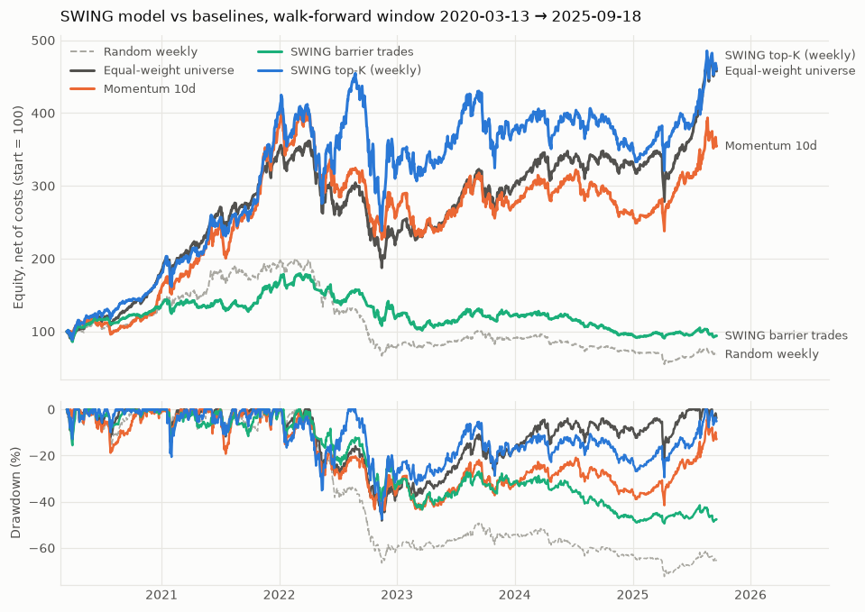
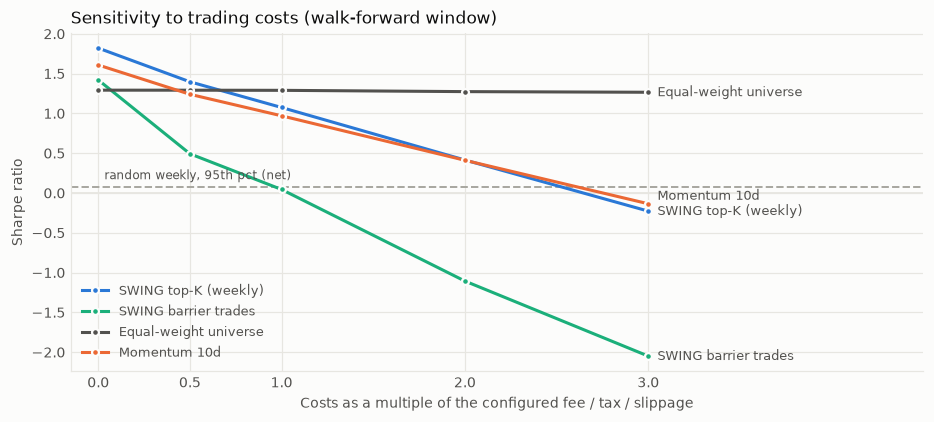
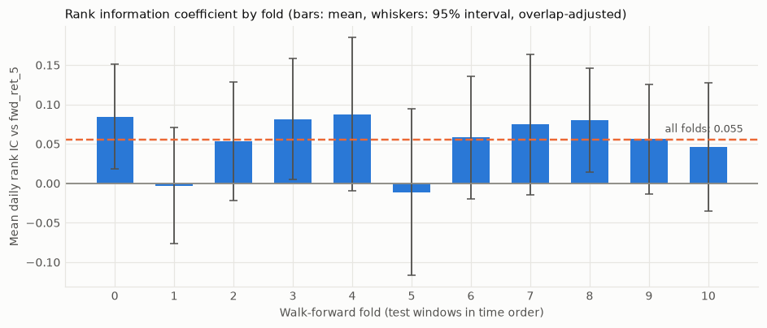
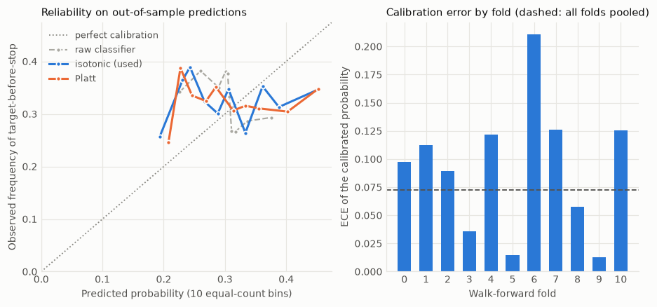

# SWING model — walk-forward 2020-03-13 → 2025-09-18

Universe **LARGE50** · run `5ab85924b41a0adc` · dataset `a247a5f639d3` · seed 42 · held-out period 2025-09-19 → 2026-09-18 **untouched**.

## Verdict

**The SWING model does not beat the baselines after costs.** Primary strategy (top-10 by rank score, weekly): net Sharpe 1.07, CAGR 31.9%, max drawdown -47.6%; equal_weight over the same window: 1.29. 1 of 5 pre-registered criteria fail; it beats equal-weight in 4 of 11 test windows. The held-out period stays closed and the configuration is not tuned further.

| pre-registered criterion | value | threshold | detail | met |
| --- | --- | --- | --- | --- |
| net Sharpe above every portfolio baseline | 1.075 | 1.290 | best baseline: equal_weight | **no** |
| net Sharpe above the random-weekly 95th percentile | 1.075 | 0.077 | 20 seeds, same window and costs | yes |
| rank IC t-statistic >= 2.0 | 4.421 | 2.000 | mean IC 0.0554 | yes |
| share of test windows with positive net Sharpe >= 0.6 | 0.636 | 0.600 | 7 of 11 windows | yes |
| net Sharpe > 0 at 2x costs | 0.415 | 0.000 |  | yes |

## Results against the baselines (same window, same engine, same costs)

| strategy | CAGR net | Sharpe net | max DD | turnover (×/yr) | CAGR gross | Sharpe gross | Sharpe at 2× costs |
| --- | --- | --- | --- | --- | --- | --- | --- |
| **SWING top-K (weekly)** | 31.9% | 1.07 | -48% | 32.3 | 64.7% | 1.82 | 0.41 |
| **SWING barrier trades** | -1.1% | 0.04 | -49% | 39.7 | 29.5% | 1.42 | -1.11 |
| Equal-weight universe | 31.7% | 1.29 | -48% | 0.2 | 31.8% | 1.29 | 1.27 |
| Momentum 10d | 25.8% | 0.97 | -44% | 25.5 | 49.8% | 1.61 | 0.41 |
| Mean reversion | -8.0% | -0.21 | -78% | 27.7 | 10.8% | 0.54 | -0.85 |
| Momentum 6-12m | 32.2% | 1.15 | -57% | 3.0 | 35.2% | 1.23 | 1.08 |
| Momentum 6-12m inv-vol | 30.1% | 1.13 | -57% | 3.2 | 32.9% | 1.21 | 1.06 |
| Random weekly | -6.6% | -0.15 | -72% | 40.8 | 22.4% | 0.94 | -1.08 |
| Random monthly | 17.7% | 0.77 | -54% | 9.5 | 25.3% | 1.02 | 0.54 |
| VNINDEX buy&hold | 15.2% | 0.83 | -40% | 0.0 | 15.2% | 0.83 | 0.82 |
| VN30 buy&hold | 17.6% | 0.91 | -42% | 0.0 | 17.7% | 0.91 | 0.90 |

Average invested fraction: top-K 99%, barrier trades 72% (no position at all on 2% of the barrier strategy's sessions).

Random top-10 portfolios, weekly, 20 seeds over the same window: net Sharpe median -0.07, 5th–95th percentile -0.36 … 0.08; gross median 1.04.

Sharpe ratios over this window have a standard error of roughly 0.5: differences of a few tenths are not evidence. All levels carry the universe look-ahead and adjusted-price caveats of the baselines report.

## Ranking quality (rank IC)

Daily cross-sectional Spearman correlation between the score at the close and the realised `fwd_ret_5`; t-statistic uses days / 5 as the effective sample (overlapping windows).

| score | days | mean IC | std | ICIR | t-stat | days IC>0 |
| --- | --- | --- | --- | --- | --- | --- |
| swing_lgbm | 1374 | 0.0554 | 0.208 | 0.27 | 4.42 | 61% |
| mom_short (ret_10) | 1374 | 0.0150 | 0.235 | 0.06 | 1.06 | 53% |
| mean_reversion (-zscore_20) | 1374 | -0.0053 | 0.214 | -0.02 | -0.41 | 48% |
| ret_5 | 1374 | -0.0024 | 0.224 | -0.01 | -0.18 | 51% |

## Walk-forward folds

| fold | train | test | fit rows | val rows | purged (label open at test start) | unlabelled rows dropped | rank trees | rank IC | SWING Sharpe | equal-weight Sharpe |
| --- | --- | --- | --- | --- | --- | --- | --- | --- | --- | --- |
| 0 | 2018-02-28 → 2020-02-27 | 2020-03-13 → 2020-09-09 | 17630 | 6125 | 0 | 0 | 11 | 0.085 | 2.33 | 1.98 |
| 1 | 2018-02-28 → 2020-08-25 | 2020-09-10 → 2021-03-11 | 23807 | 6119 | 0 | 0 | 10 | -0.003 | 2.88 | 4.21 |
| 2 | 2018-02-28 → 2021-02-25 | 2021-03-12 → 2021-09-09 | 29838 | 6102 | 0 | 3 | 15 | 0.054 | 2.13 | 2.71 |
| 3 | 2018-02-28 → 2021-08-24 | 2021-09-10 → 2022-03-11 | 35916 | 6247 | 0 | 3 | 72 | 0.082 | 3.22 | 2.77 |
| 4 | 2018-02-28 → 2022-02-25 | 2022-03-14 → 2022-09-09 | 42269 | 6244 | 0 | 3 | 55 | 0.088 | 0.66 | -0.99 |
| 5 | 2018-02-28 → 2022-08-24 | 2022-09-12 → 2023-03-13 | 48458 | 6250 | 0 | 3 | 45 | -0.011 | -0.94 | -1.03 |
| 6 | 2018-02-28 → 2023-02-27 | 2023-03-14 → 2023-09-11 | 54702 | 6250 | 0 | 3 | 1 | 0.058 | 2.69 | 3.86 |
| 7 | 2018-02-28 → 2023-08-24 | 2023-09-12 → 2024-03-12 | 61014 | 6250 | 0 | 3 | 210 | 0.075 | -0.53 | 0.27 |
| 8 | 2018-02-28 → 2024-02-27 | 2024-03-13 → 2024-09-11 | 67280 | 6250 | 0 | 3 | 147 | 0.080 | -0.35 | -0.03 |
| 9 | 2018-02-28 → 2024-08-26 | 2024-09-12 → 2025-03-13 | 73508 | 6250 | 0 | 3 | 201 | 0.056 | -0.80 | 0.63 |
| 10 | 2018-02-28 → 2025-02-27 | 2025-03-14 → 2025-09-12 | 79681 | 6250 | 0 | 3 | 255 | 0.046 | 1.75 | 2.39 |

Embargo 10 sessions, validation = last 125 sessions of each training window, samples purged by the end date of their labels. With an embargo equal to the barrier horizon no label is still open when the test window starts (0 purged in every fold; the tests check the purge on data where it does bite). The few unlabelled rows are instrument-days with no label at all (three days of one suspended instrument in October 2020).

## Calibration of the probability "target before stop within 10 sessions"

Out-of-sample: 68,330 predictions, observed base rate 32.7%. The calibrator is fitted on each fold's validation rows and never sees its test window. Lower Brier / log loss / ECE is better; AUC is of the ranking (0.5 = none). The mean of the per-fold AUCs of the raw classifier is 0.510 (range 0.442 … 0.547); the pooled AUC mixes folds whose probabilities are centred differently and is shown only for completeness.

| probability | Brier | log loss | ECE (10 equal-count bins) | AUC (pooled) | mean predicted |
| --- | --- | --- | --- | --- | --- |
| raw | 0.2240 | 0.6417 | 0.0701 | 0.455 | 0.303 |
| isotonic | 0.2264 | 0.6473 | 0.0728 | 0.496 | 0.312 |
| platt | 0.2260 | 0.6463 | 0.0701 | 0.494 | 0.312 |
| constant: the training base rate of each model | 0.2234 | 0.6403 |  | 0.500 |  |
| constant: the calibration-window base rate of each model | 0.2262 | 0.6466 |  | 0.500 |  |
| constant: the pooled out-of-sample rate (hindsight) | 0.2201 | 0.6321 |  | 0.500 | 0.327 |

| fold | event rate in the test window | calibration-window rate | training rate | AUC (raw) | highest calibrated probability | ECE |
| --- | --- | --- | --- | --- | --- | --- |
| 0 | 34.3% | 25.6% | 25.4% | 0.537 | 0.32 | 0.097 |
| 1 | 43.8% | 31.6% | 25.5% | 0.537 | 0.36 | 0.112 |
| 2 | 36.1% | 45.1% | 26.3% | 0.470 | 0.60 | 0.089 |
| 3 | 33.2% | 35.7% | 29.8% | 0.511 | 0.37 | 0.036 |
| 4 | 21.7% | 34.2% | 30.6% | 0.519 | 0.40 | 0.122 |
| 5 | 23.2% | 22.2% | 31.1% | 0.538 | 0.26 | 0.015 |
| 6 | 44.2% | 22.4% | 30.1% | 0.484 | 0.24 | 0.211 |
| 7 | 28.5% | 41.8% | 29.3% | 0.519 | 0.53 | 0.126 |
| 8 | 26.6% | 29.8% | 30.3% | 0.442 | 0.44 | 0.057 |
| 9 | 29.9% | 28.6% | 30.3% | 0.504 | 0.29 | 0.013 |
| 10 | 38.8% | 28.0% | 30.3% | 0.547 | 0.39 | 0.126 |

## Return quantiles and holding time

Quantiles of `fwd_ret_5` (sorted per row so they never cross): observed share below q10 / q50 / q90 = 10.7% / 48.8% / 88.6% (nominal 10 / 50 / 90%); q10–q90 interval covers 77.9% (nominal 80%). Pinball loss model / constant: q10 0.00992 / 0.01029, q50 0.02020 / 0.02001, q90 0.01008 / 0.01069.

Expected holding time (sessions until a barrier is touched, time-outs counted at 10) from similar past signals; mean absolute error of the median 2.70 sessions against 2.67 for always guessing the overall median.

| bucket (by predicted median) | n | predicted median | predicted p75 | realised median | realised p75 |
| --- | --- | --- | --- | --- | --- |
| 0 | 13666 | 3.6 | 6.7 | 4.0 | 8.0 |
| 1 | 13666 | 4.0 | 7.2 | 4.0 | 7.0 |
| 2 | 13666 | 4.0 | 7.5 | 4.0 | 7.0 |
| 3 | 13666 | 4.0 | 7.8 | 4.0 | 8.0 |
| 4 | 13666 | 5.1 | 9.0 | 4.0 | 8.0 |

## What drives the score

| feature | share of gain (final model, rank booster) |
| --- | --- |
| ret_1 | 11.0% |
| don_lo_dist_20 | 8.3% |
| macd_pct | 7.7% |
| rs_10 | 6.5% |
| macd_hist_pct | 6.4% |
| don_hi_dist_20 | 6.1% |
| gap_1 | 5.8% |
| atr_pct_14 | 4.9% |
| ret_3 | 4.7% |
| ret_5_csrank | 3.9% |

A stored signal with its explanation (`predictions.details`; TreeSHAP contributions of the rank score, feature value → contribution):

* 2025-09-12 · PC1 · rank 1 · P(target before stop) 0.30 raw → 0.24 calibrated · q10/q50/q90 -6.0% / 1.2% / 8.1% · holding median 5, p75 9 sessions (n = 1689) · don_hi_dist_20=-0.176 → +0.025; macd_pct=0.001 → +0.014; macd_hist_pct=-0.01 → +0.007; gap_1=0.013 → +0.007
* 2025-09-12 · SSI · rank 2 · P(target before stop) 0.30 raw → 0.24 calibrated · q10/q50/q90 -7.9% / 0.6% / 10.4% · holding median 5, p75 9 sessions (n = 1689) · don_lo_dist_20=0.215 → +0.022; ret_5_csrank=0.74 → -0.007; gap_1=0.009 → +0.006; atr_pct_14=0.045 → -0.004

## Sensitivities (report only, nothing here chose the configuration)

**Top-K weekly, number of names K**

| setting | CAGR net | Sharpe net | max DD | turnover | Sharpe gross | Sharpe at 2× costs |
| --- | --- | --- | --- | --- | --- | --- |
| K = 5 | 25.8% | 1.03 | -42% | 27.6 | 1.77 | 0.37 |
| K = 10 | 31.9% | 1.07 | -48% | 32.3 | 1.82 | 0.41 |
| K = 20 | 23.9% | 0.93 | -49% | 25.4 | 1.57 | 0.36 |

**Top-K weekly, minimum calibrated probability (multiple of the calibration window's base rate; fewer names pass → the rest stays in cash)**

| setting | CAGR net | Sharpe net | max DD | turnover | Sharpe gross | Sharpe at 2× costs |
| --- | --- | --- | --- | --- | --- | --- |
| no filter | 31.9% | 1.07 | -48% | 32.3 | 1.82 | 0.41 |
| ≥ 1.0× base rate | -1.4% | 0.05 | -59% | 26.6 | 0.85 | -0.63 |
| ≥ 1.25× base rate | -2.5% | -0.45 | -20% | 2.3 | -0.17 | -0.69 |
| ≥ 1.5× base rate | 0.0% | n/a | 0% | 0.0 | n/a | n/a |

**Barrier trades, target / stop in ATR** (the probability was calibrated for the 2 / 1 barrier only; other pairs use it as a ranking filter)

| setting | CAGR net | Sharpe net | max DD | turnover | Sharpe gross | Sharpe at 2× costs |
| --- | --- | --- | --- | --- | --- | --- |
| 2/1 ATR | -1.1% | 0.04 | -49% | 39.7 | 1.42 | -1.11 |
| 3/1.5 ATR | 7.7% | 0.46 | -48% | 29.5 | 1.30 | -0.38 |
| 1.5/1 ATR | -3.1% | -0.07 | -52% | 44.1 | 1.55 | -1.34 |
| 4/2 ATR | 6.4% | 0.40 | -44% | 25.8 | 1.22 | -0.41 |

**Barrier trades, minimum calibrated probability**

| setting | CAGR net | Sharpe net | max DD | turnover | Sharpe gross | Sharpe at 2× costs |
| --- | --- | --- | --- | --- | --- | --- |
| no filter | 0.4% | 0.15 | -64% | 43.5 | 1.40 | -0.82 |
| ≥ 1.0× base rate | -1.1% | 0.04 | -49% | 39.7 | 1.42 | -1.11 |
| ≥ 1.25× base rate | -3.8% | -0.58 | -21% | 4.9 | -0.02 | -1.04 |
| ≥ 1.5× base rate | 0.0% | n/a | 0% | 0.0 | n/a | n/a |

**Primary strategy, one cost component at a time** (the other components stay at the configured values)

| setting | CAGR net | Sharpe net | max DD | turnover |
| --- | --- | --- | --- | --- |
| slippage x0 | 44.2% | 1.38 | -46% | 32.2 |
| slippage x2 | 23.5% | 0.85 | -48% | 32.3 |
| slippage x3 | 15.6% | 0.63 | -50% | 32.4 |
| fee and tax x0 | 50.5% | 1.52 | -46% | 32.1 |
| fee and tax x2 | 15.7% | 0.64 | -49% | 32.5 |

Fee, tax and slippage all scaled together (0×, 0.5×, 1×, 2×, 3×) is in the results table and the chart above.

## Changes made after the first run had been looked at

Mechanical corrections of things the first run exposed (and, for the third, a leak found later); none touches the rank score, the primary strategy or the pre-registered decision rule. The earlier figures are kept next to each. The primary strategy's numbers are identical before and after.

1. **Found:** isotonic calibration on raw validation points output a probability of 1.0 in 3 of 11 folds (a few top-scored rows were all events). **Change:** isotonic is fitted on equal-count bins of at least swing.isotonic_min_bin (150) validation rows. **Affects:** the calibrated probability, hence the secondary (barrier) strategy and the calibration report; NOT the rank score, hence not the primary strategy or the verdict. **First run:** isotonic ECE 0.0725 vs raw 0.0694 (calibration did not help out of sample).
2. **Found:** the barrier strategy was flat (no position) for whole test windows: it required probability >= the TRAINING base rate but the calibrated probability is centred on the VALIDATION base rate, which was lower in 4 of 11 folds, so no name could pass. **Change:** the entry threshold is a multiple of the base rate of the validation rows the calibrator was fitted on. **Affects:** the secondary (barrier) strategy and its sensitivities only. **First run:** barrier trades: net CAGR 4.4%, Sharpe 0.32, no position at all in the test windows of folds 5, 6, 9 and 10.
3. **Found:** the IC, quantile, calibration and holding-time figures used forward labels (5 / 10 sessions) of the last development days, whose windows end after 2025-09-19: up to 10 sessions of held-out prices entered those figures through the labels (the portfolio backtests stop before the held-out period and were not affected). **Change:** those figures use only rows whose label ends before the held-out period. **Affects:** IC / quantile / calibration / holding-time figures by a few last days of the last fold; not the models, not the primary strategy, not the verdict. **First run:** IC 0.0552 (t 4.41), ECE raw 0.0694 / isotonic 0.0722 before the change.

## Tuning and reproducibility

Optuna: 25 trials on the first fold's training/validation rows (17630 / 6125); 25 completed, 0 failed; best validation rank IC 0.0590. Every trial is an `experiments` row (`swing:optuna:14a9ddb7015693fe:trialNNN`). Frozen parameters: `{"lambda_l2": 27.227565966618993, "num_leaves": 7, "learning_rate": 0.05837170382627645, "bagging_fraction": 0.6327969378397664, "feature_fraction": 0.9075422298998976, "min_child_samples": 101}`. The tuning used validation rows only; the ICs above come from test windows the tuning never saw, but the choice of *which* fold to tune on was made once and in advance.

Models are registered in `models` as `swing_lgbm_fNN` (one per fold) and `swing_lgbm_final` (all development data, v2, sha256 `fe1a5bb6a044b2ed…`), status `candidate`; 68,479 out-of-sample predictions are stored in `predictions` with q10/q50/q90, holding time and SHAP contributions in `details`. Re-running with unchanged data and configuration reproduces identical model files (same sha256) and reuses the registered rows.

## Assumptions and limits

* Everything in [BASELINES.md](BASELINES.md) applies: universe look-ahead/survivorship (LARGE50 = today's 50 most traded names), dividend-adjusted vendor prices, inferred price bands, T+2 for the whole period, brief-default costs (not re-verified), no market-impact model, ~6 years of one history.
* The comparison window starts at the first walk-forward test session (the model needs ≥ 500 sessions of training data), so the baselines were re-run over that same window; numbers differ from BASELINES.md, which starts in 2019.
* Labels use ATR-based barriers measured from the signal-day close; the barrier strategy trades from the next open with the stop and target expressed as a percentage of the signal-day close, so its realised barriers differ slightly from the label's.
* The quantile boosters use early stopping on the validation window; a booster that stops after a handful of trees is a near-constant quantile (a sign of weak signal, not of a bug).
* The test windows (~6 months each, 11 of them, one path of history) are a small sample of market regimes; they include the March 2020 crash and rebound, the 2021 boom and the 2022 bear market.
* The held-out period was not used for any model choice, tuning or figure in this report.
